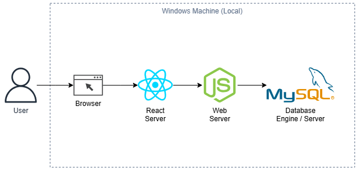
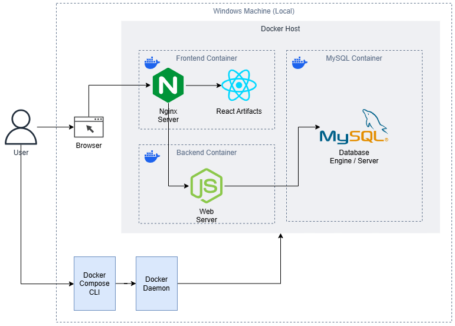
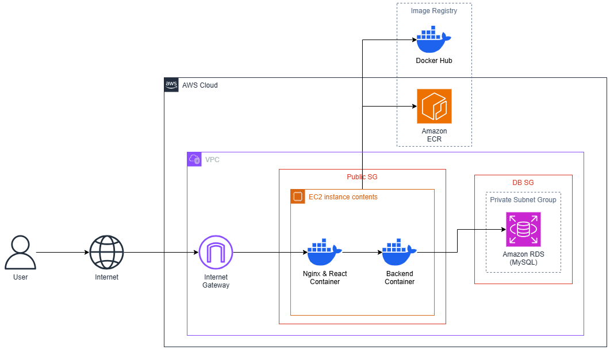
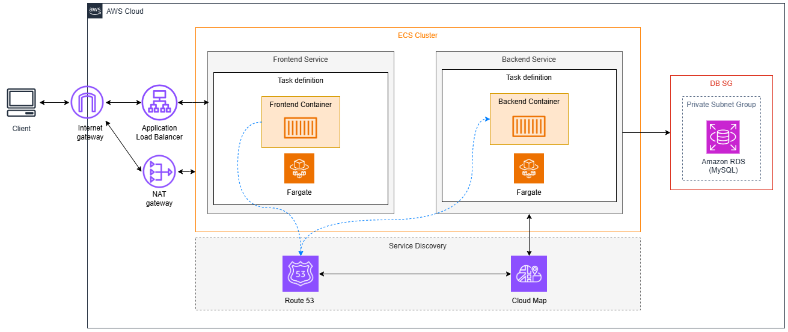
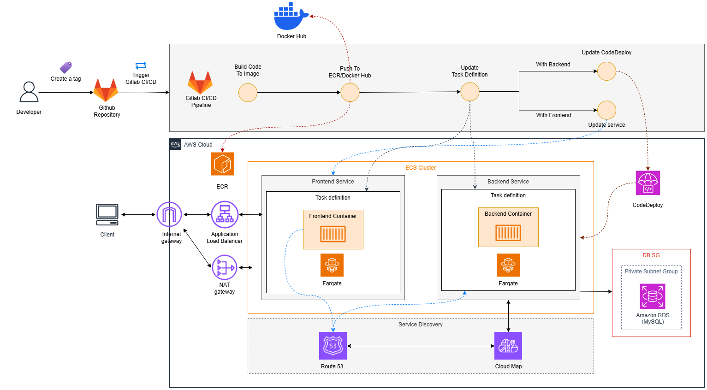
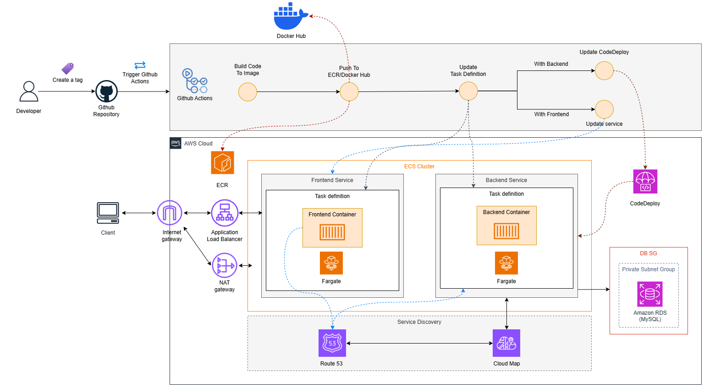
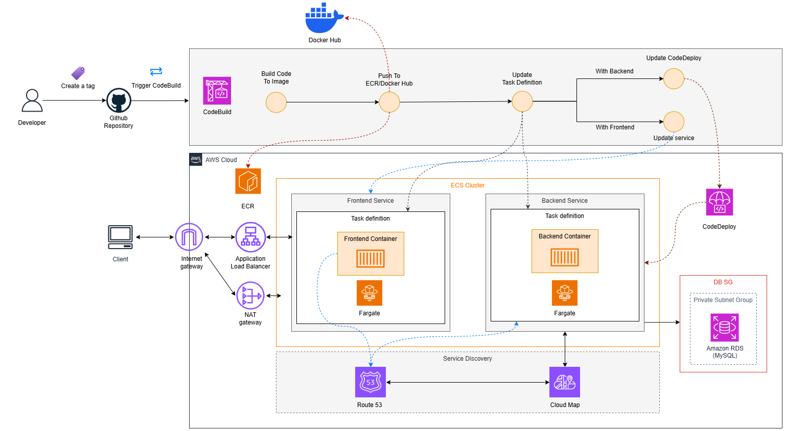

<!-- PROJECT LOGO -->
<br />
<p align="center">
   <a href="https://github.com/AWS-First-Cloud-Journey">
    
  </a>

  <h3 align="center">FCJRESBAR</h3>
  <p align="center">Restaurant Management Application</p>
  <p>Easily deploy your fullstack appilcation in your personal computer or in the Cloud with this sample.</p>
</p>

<!-- TABLE OF CONTENTS -->

## Table of Contents

- [Table of Contents](#table-of-contents)
- [About this Repository](#about-this-repository)
- [Examples](#examples)
  - [Deploy on your own PC](#deploy-on-your-own-pc)
    - [A - Directly deploy on local machine (windows).](#a---directly-deploy-on-local-machine-windows)
    - [B - Deploy on Docker with Docker Compose.](#b---deploy-on-docker-with-docker-compose)
  - [Deploy on AWS](#deploy-on-aws)
    - [A - Deploy on EC2 with separate Docker Image and Docker Container](#a---deploy-on-ec2-with-separate-docker-image-and-docker-container)
    - [B - Deploy on EC2 with Docker Compose](#b---deploy-on-ec2-with-docker-compose)
    - [C - Deploy on ECS](#c---deploy-on-ecs)
  - [Implement CI/CD](#implement-cicd)
    - [A - With GitLab and EC2 as Runner](#a---with-gitlab-and-ec2-as-runner)
    - [B - With Github Actions only](#b---with-github-actions-only)
    - [C - With GitHub and CodeBuild](#c---with-github-and-codebuild)
- [Additional Resources](#additional-resources)

## About this Repository

In this repository, there are 3 applications: **Frontend** with `Nginx` and `React`; **Backend** with `NodeJS` and `ExpressJS`; **Database** with `MySQL`. Sources & configurations of these applications are stored in corresponding folders, you will know purposes of these files later.

For now, you just have to know that this repository is used to build with [**AWS First Cloud Journey**](https://cloudjourney.awsstudygroup.com/) Workshops.

This repository can be used in some scenarios of deployments, see more details in the **Examples** section.

## Examples

All of these examples are built for our use cases. If you want to use in your own use cases, you should to modify the configurations and follow these requirements:

1. **MySQL Server** should have required Database, Tables and data.
2. **NodeJS Application** must be configured with correct environment variables.
3. **Nginx & React Application** will be configured depond on envinronments and strategies.

### Deploy on your own PC

This scenario is divided into 2 cases:

#### A - Directly deploy on local machine (windows).

<p align="center">
   
</p>

If you deploy in this case, you have to install MySQL Server (Community) and make sure it is running on your local machine, then install dependencies and libraries to deploy appications.

1. Install these dependencies:

   1. NodeJS (NPM included):
      - [With Installer](https://nodejs.org/en/download/prebuilt-installer).
      - [With CMD](https://nodejs.org/en/download/package-manager).
   2. MySQL Community Server: [Here](https://dev.mysql.com/downloads/file/?id=534098).
   3. Git: [Here](https://git-scm.com/downloads/win).

2. Create Database and Tables with **MySQL Shell**.

3. Modify the environment variables in `.env` in `backend` directory.

4. Modify the congifuration in `vite.config.js` file to use proxy feature of Vite in `frontend` directory.

For more details, you can follow [these steps](https://000015.awsstudygroup.com/vi/2-deploy-local/2-deploy-application/).

> Note
>
> In this case, we don't have to use **Nginx** with **React**, because **React** is running with its development server which is provided by **Vite**.

#### B - Deploy on Docker with Docker Compose.

<p align="center">
   
</p>

If you deploy in this case, you have to enable WSL2 and install Ubuntu Distro on you Windows Machine, then install **Docker**.

1. Install these dependencies:

   1. Enable **WSL2** and install **Ubuntu 24.04.1 LTS** Distro: [follow these steps](https://learn.microsoft.com/en-us/windows/wsl/install).
   2. Install **Docker Desktop** (GUI with Docker Engine): [here](https://docs.docker.com/desktop/install/windows-install/).

2. Run this command to let docker builds images, and run containers.

```cmd
cd aws-fcj-container-app
docker compose -f docker-compose.yml up
```

3. Type `http://localhost:3000` to search bar in your browser and hit enter to see the result.

> Note
>
> **Docker** will pull **MySQL Server Image** and automatically create required database, tables and insert example data. Then it will build Docker Image for Frontend and Backend application with `frontend/Dockerfile` and `backend/Dockerfile`.
>
> **React** Application will be built an antifacts and will be served by **Nginx**.

### Deploy on AWS

<p align="center">
   
</p>

Before you do these examples, you have to make sure that:

1. You must have an **AWS account**.
2. You have a **Docker account** (Optional).
3. You must have a base knowledge about Cloud, such as **EC2**, **RDS**, **Networking on Cloud**, **ECS**, ...
4. Deploy a Network Infrastructure and configure some services for these example, you can view more details [here](https://000015.awsstudygroup.com/3-preparation/).
5. Deploy a RDS Instance, you can view more details [here](https://000015.awsstudygroup.com/4-configure-rds/).
6. Configure and Launch an **EC2** to install required dependencies like **Docker**, **MySQL Client**, ..., you can view more details [here](https://000015.awsstudygroup.com/5-configure-ec2/).

And this scenario is divided into 3 cases, let's start!

#### A - Deploy on EC2 with separate Docker Image and Docker Container

1. Make sure that **Docker Engine**, **Docker Daemon**, **Docker CLI**, **Git**, ... are installed on **EC2**.

2. Clone this repository in your **EC2** instance.

3. Change directory to `frontend` and build Frontend Image (Nginx and React).

4. Change directory to `backend`, modify `DB_HOST` variable with the public DNS of **RDS Instance** in `.env` file, then build Backend Image (NodeJS and ExpressJS).

5. Create a Docker Network to use to add Frontend and Backend Container into a Network.

6. Run Containers with these Images and view result with **EC2**'s public DNS Hostname.

For more details, you can follow [these steps](https://000015.awsstudygroup.com/6-docker-image/).

#### B - Deploy on EC2 with Docker Compose

1. Make sure all dependencies and the source code are installed and RDS Instance is running.

2. Change directory to `docker-compose-env`, and modify `DB_HOST`
   variable with the public DNS of **RDS Instance**. In this example, we will use docker compose with `docker-compose.app.yml`, because Database Container is managed by **Amazon RDS**, so we don't have to install Database Server with Docker Compose.

3. Run this command to deploy application

```bash
sudo docker compose -f docker-compose.app.yml up
```

4. Go to `http://ec2-public-dns:3000` to view the result.

For more details, you can follow [these steps](https://000015.awsstudygroup.com/7-docker-compose/).

#### C - Deploy on ECS

<p align="center">
   
</p>

Now, we will use **ECS** to deploy our application instead of **EC2**. Before you go to further, make sure that:

1. RDS Instance is still running.
2. Update Infrastructure. For more details, [view here](https://000016.awsstudygroup.com/2-preparation/).
3. Create **ECR** or **Docker Hub** Repository, build and upload images to **ECR** / **Docker Hub**. For more details, [view here](https://000016.awsstudygroup.com/3-prepare-for-deployment/). Note that, with **frontend image**, you have to build with `frontend/Dockerfile.prod` file.

That's all requirements. Our containers will be managed directly by **ECS Services** with **Task Definitions**, and all of them are deployed in **ECS Cluster**. Let's start!

1. For internal DNS, you have to register a namespace in **Amazon Cloud Map** and create a Service name for Backend.
2. Create an **ECS Cluster** for our application.
3. Create 2 **Task Definitions** for **Frontend** and **Backend** Container with their images.
4. Create and configure **Application Load Balancer** to let users reach Containers inside **ECS Cluster**. In the previous guide, we deploy our application on a **Public Subnet**, so in this part, we must to deploy our **ECS Cluster** on a **Private Subnet**. With Frontend Task, you have to assign `BACKEND_HOST` and `BACKEND_PORT` to let **Docker** uses the `default.template.conf` to build suitable **Nginx** Configuration before **Nginx** starts.
5. Create 2 **ECS Services** for **Frontend** and **Backend**. With Backend Service, you have to enable **Service Discovery** and assign **Namespace** and **Service** that we configured in `step 1`.
6. View the result with `http://alb-public-dns`. At this time, we have to request to `Port 80` for the right access to our application.

For more details, you can follow [these steps](https://000016.awsstudygroup.com/) (from Section 4 to 8).

### Implement CI/CD

Before you perform this use case, make sure that:

1. You have a **GitHub** / **GitLab** account, and you can choose one of them.
2. You have a fundamental knowledge about **CI/CD**, for more details, go to **Additional Resources** section.
3. Fork or Clone and Create 3 new Repositories with this repository in your **GitHub** / **GitLab** account.

In this scenario, we will implement CI/CD with GitLab and EC2; with GitHub Actions; with Github and CodeBuild. That's all requirements, let's start!

#### A - With GitLab and EC2 as Runner

<p align="center">
   
</p>

We will register a EC2 Instance as a Runner. And this EC2 Instance will be attached a IAM Role with suitable permissions. For more details, you can follow [these steps](https://000017.awsstudygroup.com/3-cicd-gitlab/).

#### B - With Github Actions only

<p align="center">
   
</p>

We will need an AWS Account with suitable permissions to to this part. For more details, you can follow [these steps](https://000017.awsstudygroup.com/4-cicd-github/).

#### C - With GitHub and CodeBuild

<p align="center">
   
</p>

We will need to setup 2 **CodeBuild** Projects for Frontend and Backend, then use Github Actions to trigger CodeBuild to deploy application. For more details, you can follow [these steps](https://000017.awsstudygroup.com/5-cicd-codebuild/).

> Note
>
> With these use cases, we have to have a runner which is perform the instruction from YAML files. These files are configured in `.github/workflows` in GitHub repository or `.gitlab-ci.yml` for GitLab repository. And we have to add environment variables (serects) for both of GitLab and GitHub repository to run Pipeline properly.

## Additional Resources

1. Read more about **Docker**: [https://www.docker.com/](https://www.docker.com/)
2. Read more about **ECS**: [Amazon ECS](https://docs.aws.amazon.com/AmazonECS/latest/developerguide/Welcome.html)
3. Read more about **CI/CD**:
   - With GitLab: [What is CI/CD?](https://about.gitlab.com/topics/ci-cd/)
   - With GitHub: [CI/CD: The what, why, and how](https://github.com/resources/articles/devops/ci-cd)
